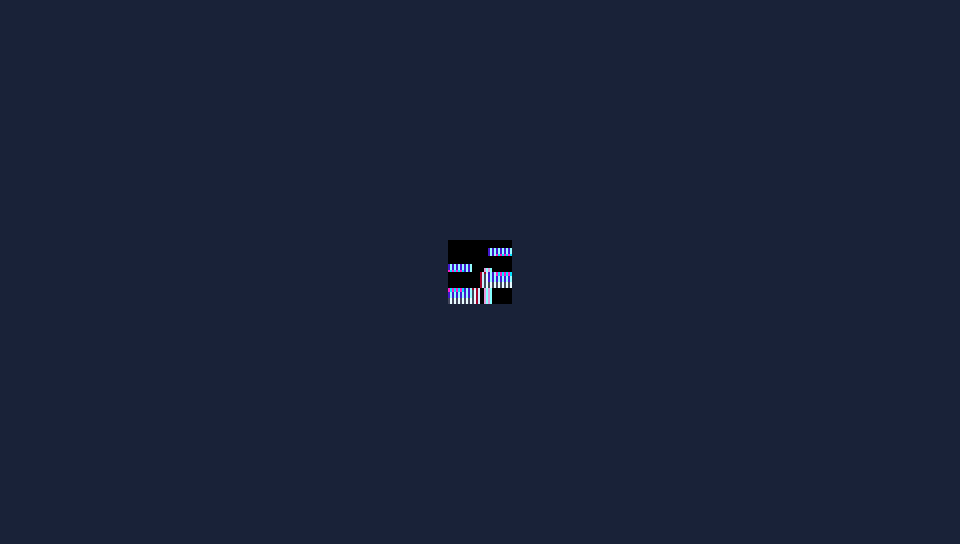

# Tutorial: Building the 2D Demo ("Hero Starter") from Scratch 🛡️

This tutorial walks through creating a full interactive 2D demo step-by-step, explaining asset management (sprites, audio, and menu icons), building the `EBOOT.PBP` executable, and writing the C99 game loop.

<div align="center">
  
  <p><em>2D Hero Starter running at a rock-solid 60 FPS on the PSP hardware rasterizer.</em></p>
</div>

---

## 1. Project Structure

A 2D project has the following essential layout (scaffolded with `psp-forge init my_2d_game --template 2d`):

```text
my_2d_game/
├── CMakeLists.txt     # Build configuration with create_pbp_file and BUILD_PRX
├── psp.toml           # Project metadata and asset cooker configuration
├── assets/            # Source media files (PNG, WAV)
│   ├── hero.png       # Main character sprite
│   ├── coin.wav       # Jump/interaction sound effect
│   ├── icon0.png      # XMB icon (144x80 PNG)
│   └── pic1.png       # XMB background (480x272 PNG)
└── src/
    └── main.c         # C99 source code
```

### The `psp.toml` Configuration File
```toml
[project]
name = "psp_2d_game"
title = "PSP 2D Starter"
version = "0.1.0"

[assets]
source_dir = "assets"
output_dir = "build/assets"
```

---

## 2. Preparing Media Assets

### A. Character Sprite (`hero.png`)
1. Create or export a PNG image (transparency with RGBA alpha channels is supported).
2. For optimal PSP GPU performance, dimensions should be powers of two ($16 \times 16$, $32 \times 32$, $64 \times 64$, etc.). In this example, we use a $32 \times 32$ sprite.
3. Save it as `assets/hero.png`.

### B. Sound Effect (`coin.wav`)
1. Save an audio file in 16-bit signed PCM WAV format (Mono or Stereo at 44100 Hz).
2. Save it as `assets/coin.wav`.

### C. Menu Artwork (`icon0.png` & `pic1.png`)
1. `icon0.png`: $144 \times 80$ PNG image displayed as the game title icon in the PSP XMB menu.
2. `pic1.png`: $480 \times 272$ PNG image displayed as the full-screen background artwork in the XMB menu.

### D. Cooking Assets with `psp-forge cook`
When you run:
```bash
psp-forge cook
```
*(Note: `psp-forge build` also invokes `psp-forge cook` automatically).*
The cooker converts assets into optimized binary files in `build/assets/`:
- `hero.tex`: Swizzled texture in $16 \times 8$ byte hardware blocks using `GU_PSM_8888`.
- `coin.snd`: 44.1 kHz 16-bit signed PCM in a custom 32-byte `PSND` binary container aligned to 64-sample increments.

---

## 3. Build Configuration (`CMakeLists.txt`)

Create `CMakeLists.txt`:

```cmake
cmake_minimum_required(VERSION 3.10)
project(psp_2d_game C)

set(CMAKE_C_STANDARD 99)

if(NOT DEFINED ENV{PSPDEV})
    set(ENV{PSPDEV} "/usr/local/pspdev")
endif()
set(PSPDEV $ENV{PSPDEV})

add_executable(psp_2d_game src/main.c)

target_compile_options(psp_2d_game PRIVATE
    -O2 -G0 -Wall -Wextra -Wno-unused-parameter -fno-strict-aliasing
)

target_link_libraries(psp_2d_game PRIVATE
    pspforge
    pspgum pspgu pspge
    pspaudio pspdisplay pspctrl psprtc pspfpu m
)

# Crucial: BUILD_PRX ensures compatibility with both PPSSPP and real hardware
create_pbp_file(
    TARGET psp_2d_game
    TITLE "PSP 2D Starter"
    BUILD_PRX
    ICON_PATH "${CMAKE_CURRENT_SOURCE_DIR}/assets/icon0.png"
    BACKGROUND_PATH "${CMAKE_CURRENT_SOURCE_DIR}/assets/pic1.png"
)
```

---

## 4. C99 Source Code (`src/main.c`)

Here is the complete implementation with texture loading, differential input, animated background, and an on-screen FPS indicator:

```c
#include <psp_forge.h>
#include <stdio.h>
#include <string.h>

PSP_MODULE_INFO("PSP_2D_GAME", 0, 1, 0);
PSP_MAIN_THREAD_ATTR(THREAD_ATTR_USER | THREAD_ATTR_VFPU);

int main(int argc, char* argv[]) {
    // 1. Transparent path resolution on Memory Stick or PC
    if (argc > 0 && argv && argv[0]) {
        forge_set_base_path(argv[0]);
    }

    // 2. Initialize graphics and audio runtime
    forge_init(0);

    // 3. Load pre-cooked binary assets
    ForgeTexture* hero_tex = forge_texture_load("assets/hero.tex");
    ForgeSound*   coin_snd = forge_sound_load("assets/coin.snd");

    // Player position and speed
    float hero_x = (FORGE_SCREEN_WIDTH  / 2.0f) - 16.0f;
    float hero_y = (FORGE_SCREEN_HEIGHT / 2.0f) - 16.0f;
    float speed  = 160.0f; /* pixels per second */
    float time_acc = 0.0f;

    ForgeInput input;

    // 4. Main game loop
    while (forge_is_running()) {
        forge_input_poll(&input);
        float dt  = forge_get_delta_time();
        float fps = forge_get_fps();
        time_acc += dt;

        // Movement via D-Pad or Analog Stick
        if (forge_input_is_held(&input, PSP_CTRL_LEFT)  || input.analog_x < -0.2f) hero_x -= speed * dt;
        if (forge_input_is_held(&input, PSP_CTRL_RIGHT) || input.analog_x >  0.2f) hero_x += speed * dt;
        if (forge_input_is_held(&input, PSP_CTRL_UP)    || input.analog_y < -0.2f) hero_y -= speed * dt;
        if (forge_input_is_held(&input, PSP_CTRL_DOWN)  || input.analog_y >  0.2f) hero_y += speed * dt;

        // Screen boundaries (480x272)
        if (hero_x < 0.0f)                          hero_x = 0.0f;
        if (hero_x > (FORGE_SCREEN_WIDTH  - 32.0f)) hero_x = FORGE_SCREEN_WIDTH  - 32.0f;
        if (hero_y < 0.0f)                          hero_y = 0.0f;
        if (hero_y > (FORGE_SCREEN_HEIGHT - 32.0f)) hero_y = FORGE_SCREEN_HEIGHT - 32.0f;

        // Press Cross button to trigger sound effect
        if (forge_input_is_pressed(&input, PSP_CTRL_CROSS)) {
            if (coin_snd) forge_sound_play(coin_snd, 0);
        }

        // Animated background: slow color drift
        float t   = time_acc * 0.4f;
        float frac = t - (int)t;
        int   r_bg = (int)(18.0f + 12.0f * frac);
        int   g_bg = (int)(28.0f + 10.0f * frac);
        uint32_t bg = 0xFF000000 | (r_bg & 0xFF) | ((g_bg & 0xFF) << 8) | (0x38 << 16);

        // 5. Begin frame rendering
        forge_begin_frame();
        forge_clear(bg);

        // Render 2D textured sprite using pixel texel coordinates
        if (hero_tex) {
            forge_draw_sprite(
                hero_tex,
                hero_x, hero_y, 32.0f, 32.0f, // Screen destination (x, y, w, h)
                0.0f, 0.0f, (float)hero_tex->width, (float)hero_tex->height // Source texel crop
            );
        }

        // Performance HUD indicator bar (green = 60fps)
        {
            float bar_w = (fps / 60.0f) * 80.0f;
            if (bar_w > 80.0f) bar_w = 80.0f;
            if (bar_w < 2.0f)  bar_w = 2.0f;

            typedef struct { float x, y, z; } HudVtx;
            HudVtx* bg_bar = (HudVtx*)sceGuGetMemory(2 * sizeof(HudVtx));
            if (bg_bar) {
                bg_bar[0].x = 396.0f; bg_bar[0].y = 2.0f;  bg_bar[0].z = 0.0f;
                bg_bar[1].x = 478.0f; bg_bar[1].y = 10.0f; bg_bar[1].z = 0.0f;
                sceGuDisable(GU_TEXTURE_2D);
                sceGuColor(0xFF333333);
                sceGuDrawArray(GU_SPRITES, GU_VERTEX_32BITF | GU_TRANSFORM_2D, 2, NULL, bg_bar);
            }
            HudVtx* bar = (HudVtx*)sceGuGetMemory(2 * sizeof(HudVtx));
            if (bar) {
                uint32_t bar_color = (fps >= 55.0f) ? 0xFF00DD00 :
                                     (fps >= 28.0f) ? 0xFF00CCDD : 0xFF0000FF;
                bar[0].x = 396.0f;          bar[0].y = 2.0f;  bar[0].z = 0.0f;
                bar[1].x = 396.0f + bar_w;  bar[1].y = 10.0f; bar[1].z = 0.0f;
                sceGuColor(bar_color);
                sceGuDrawArray(GU_SPRITES, GU_VERTEX_32BITF | GU_TRANSFORM_2D, 2, NULL, bar);
            }
        }

        forge_end_frame();
    }

    // 6. Free resources on shutdown
    if (hero_tex) forge_texture_free(hero_tex);
    if (coin_snd) forge_sound_free(coin_snd);

    forge_shutdown();
    sceKernelExitGame();
    return 0;
}
```

---

## 5. Building and Running

To compile and launch:
```bash
psp-forge build
psp-forge run
```
