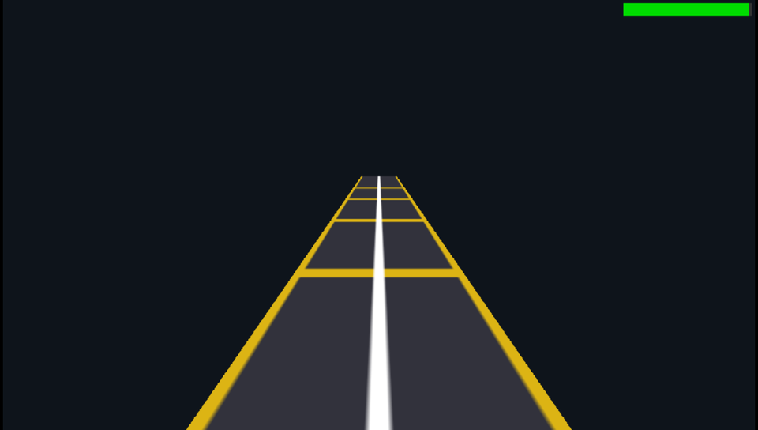

# Tutorial: Building the 3D Demo ("Track Runner") from Scratch 🏎️

This tutorial explains how to build an interactive 3D scene from scratch on the Sony PSP, handling Wavefront OBJ models, texture mapping, dynamic perspective cameras, vertical jumping physics, and endless track scrolling at 60 FPS.

<div align="center">
  
  <p><em>3D Track Runner featuring textured highway polygons, perspective camera view, and jump physics.</em></p>
</div>

---

## 1. Project Structure

```text
my_3d_runner/
├── CMakeLists.txt     # Build configuration with BUILD_PRX
├── psp.toml           # Project metadata
├── assets/
│   ├── track.obj      # 3D geometric mesh (Wavefront OBJ)
│   ├── track.png      # Track texture (64x64 RGBA)
│   ├── jump.wav       # Jump sound effect
│   ├── icon0.png      # XMB menu icon
│   └── pic1.png       # XMB menu background
└── src/
    └── main.c         # C99 3D source code
```

---

## 2. Preparing 3D Models (`track.obj`) and Textures

### A. Track Geometry (`track.obj`)
The model represents a rectangular track section centered at the origin, 6 units long along the $Z$ axis (from $-3.0$ to $+3.0$) and 4 units wide along the $X$ axis (from $-2.0$ to $+2.0$).

Synthetic example of `assets/track.obj`:
```obj
# Vertices (X, Y, Z)
v -2.0  0.0 -3.0
v  2.0  0.0 -3.0
v  2.0  0.0  3.0
v -2.0  0.0  3.0

# Texture Coordinates (U, V)
vt 0.0 0.0
vt 1.0 0.0
vt 1.0 1.0
vt 0.0 1.0

# Normals (NX, NY, NZ)
vn  0.0  1.0  0.0

# Triangular faces (vertex/uv/normal)
f 1/1/1 2/2/1 3/3/1
f 1/1/1 3/3/1 4/4/1
```

### B. Track Texture (`track.png`)
A $64 \times 64$ PNG image with asphalt colors (anthracite dark gray), a central white divider line, and yellow lane borders.

### C. Cooking Assets with `psp-forge cook`
Running:
```bash
psp-forge cook
```
Generates:
- `track.p3d`: Binary file containing 32-byte vertices arranged to hardware standards:
  $$\text{UV (8 bytes)} \longrightarrow \text{Normals (12 bytes)} \longrightarrow \text{Position (12 bytes)}$$
  with 16-byte alignment for GPU Direct Memory Access (DMA).
- `track.tex`: Swizzled $16 \times 8$ byte texture blocks in `GU_PSM_8888` format.
- `jump.snd`: 44.1 kHz 16-bit PCM sound aligned to 64-sample increments.

---

## 3. Build Configuration (`CMakeLists.txt`)

```cmake
cmake_minimum_required(VERSION 3.10)
project(psp_3d_runner C)

set(CMAKE_C_STANDARD 99)

if(NOT DEFINED ENV{PSPDEV})
    set(ENV{PSPDEV} "/usr/local/pspdev")
endif()
set(PSPDEV $ENV{PSPDEV})

add_executable(psp_3d_runner src/main.c)

target_compile_options(psp_3d_runner PRIVATE
    -O2 -G0 -Wall -Wextra -Wno-unused-parameter -fno-strict-aliasing
)

target_link_libraries(psp_3d_runner PRIVATE
    pspforge
    pspgum pspgu pspge
    pspaudio pspdisplay pspctrl psprtc pspfpu m
)

create_pbp_file(
    TARGET psp_3d_runner
    TITLE "PSP 3D Runner"
    BUILD_PRX
    ICON_PATH "${CMAKE_CURRENT_SOURCE_DIR}/assets/icon0.png"
    BACKGROUND_PATH "${CMAKE_CURRENT_SOURCE_DIR}/assets/pic1.png"
)
```

---

## 4. C99 Source Code (`src/main.c`)

```c
#include <psp_forge.h>
#include <math.h>

PSP_MODULE_INFO("PSP_3D_RUNNER", 0, 1, 0);
PSP_MAIN_THREAD_ATTR(THREAD_ATTR_USER | THREAD_ATTR_VFPU);

#define NUM_TRACK_SEGMENTS 6
#define SEGMENT_LENGTH     6.0f

int main(int argc, char* argv[]) {
    // 1. Transparent asset path resolution
    if (argc > 0 && argv && argv[0]) {
        forge_set_base_path(argv[0]);
    }

    forge_init(0);

    // 2. Load 3D assets
    ForgeMesh*    track_mesh = forge_mesh_load("assets/track.p3d");
    ForgeTexture* track_tex  = forge_texture_load("assets/track.tex");
    ForgeSound*   jump_snd   = forge_sound_load("assets/jump.snd");

    // 3. Configure hardware lights (white key light and blue fill light)
    forge_set_light(0,  0.0f, 4.0f, -2.0f, 0xFFFFFFFF, 2.5f);
    forge_set_light(1,  3.0f, 1.5f,  4.0f, 0xFF80C0FF, 1.8f);

    // Player state
    int   target_lane = 0; // -1: Left, 0: Center, 1: Right
    float player_x    = 0.0f;
    float player_y    = 0.0f;
    float jump_vel    = 0.0f;
    float gravity     = -20.0f;
    bool  is_grounded = true;

    // Z positions of endless track segments
    float segment_z[NUM_TRACK_SEGMENTS];
    for (int i = 0; i < NUM_TRACK_SEGMENTS; ++i) {
        segment_z[i] = (float)i * SEGMENT_LENGTH;
    }
    float scroll_speed = 10.0f; // units/second

    ForgeInput in;

    while (forge_is_running()) {
        forge_input_poll(&in);
        float dt  = forge_get_delta_time();
        float fps = forge_get_fps();

        // Lane switching (D-Pad Left / Right)
        if (forge_input_is_pressed(&in, PSP_CTRL_LEFT)  && target_lane > -1) target_lane--;
        if (forge_input_is_pressed(&in, PSP_CTRL_RIGHT) && target_lane <  1) target_lane++;

        // Smooth interpolation towards target lane
        float dest_x = (float)target_lane * 1.5f;
        player_x += (dest_x - player_x) * 12.0f * dt;

        // Jump on Cross button (X)
        if (forge_input_is_pressed(&in, PSP_CTRL_CROSS) && is_grounded) {
            jump_vel    = 7.0f;
            is_grounded = false;
            if (jump_snd) forge_sound_play(jump_snd, 0);
        }

        // Falling physics and gravity
        if (!is_grounded) {
            jump_vel += gravity * dt;
            player_y += jump_vel * dt;
            if (player_y <= 0.0f) {
                player_y    = 0.0f;
                jump_vel    = 0.0f;
                is_grounded = true;
            }
        }

        // Endless track segment scrolling and recycling
        float total_track_span = NUM_TRACK_SEGMENTS * SEGMENT_LENGTH;
        for (int i = 0; i < NUM_TRACK_SEGMENTS; ++i) {
            segment_z[i] -= scroll_speed * dt;
            if (segment_z[i] < -SEGMENT_LENGTH) {
                segment_z[i] += total_track_span;
            }
        }

        // Begin recording GPU commands
        forge_begin_frame();
        forge_clear(0xFF1B140E); // Dark midnight sky

        // 4. Configure perspective camera following the player
        // (x_eye, y_eye, z_eye, x_target, y_target, z_target, fov_degrees)
        forge_set_camera(
            player_x * 0.4f, 2.8f + player_y * 0.3f, -5.5f,
            player_x * 0.7f, 0.6f + player_y * 0.5f,  6.0f,
            65.0f
        );

        // 5. Draw 3D segments
        if (track_mesh) {
            for (int i = 0; i < NUM_TRACK_SEGMENTS; ++i) {
                forge_draw_mesh(
                    track_mesh,
                    track_tex,
                    0.0f, 0.0f, segment_z[i], // Position
                    0.0f, 0.0f, 0.0f,         // Rotation
                    1.0f, 1.0f, 1.0f          // Scale
                );
            }
        }

        // 2D On-Screen FPS Indicator
        {
            float bar_w = (fps / 60.0f) * 80.0f;
            if (bar_w > 80.0f) bar_w = 80.0f;
            if (bar_w < 2.0f)  bar_w = 2.0f;

            typedef struct { float x, y, z; } HudVtx;
            sceGuDisable(GU_DEPTH_TEST);

            HudVtx* bg = (HudVtx*)sceGuGetMemory(2 * sizeof(HudVtx));
            if (bg) {
                bg[0].x = 396.0f; bg[0].y = 2.0f;  bg[0].z = 0.0f;
                bg[1].x = 478.0f; bg[1].y = 10.0f; bg[1].z = 0.0f;
                sceGuDisable(GU_TEXTURE_2D);
                sceGuColor(0xFF333333);
                sceGuDrawArray(GU_SPRITES, GU_VERTEX_32BITF | GU_TRANSFORM_2D, 2, NULL, bg);
            }
            HudVtx* bar = (HudVtx*)sceGuGetMemory(2 * sizeof(HudVtx));
            if (bar) {
                uint32_t bar_color = (fps >= 55.0f) ? 0xFF00DD00 :
                                     (fps >= 28.0f) ? 0xFF00CCDD : 0xFF0000FF;
                bar[0].x = 396.0f;          bar[0].y = 2.0f;  bar[0].z = 0.0f;
                bar[1].x = 396.0f + bar_w;  bar[1].y = 10.0f; bar[1].z = 0.0f;
                sceGuColor(bar_color);
                sceGuDrawArray(GU_SPRITES, GU_VERTEX_32BITF | GU_TRANSFORM_2D, 2, NULL, bar);
            }

            sceGuEnable(GU_DEPTH_TEST);
        }

        forge_end_frame();
    }

    // Cleanup
    if (track_mesh) forge_mesh_free(track_mesh);
    if (track_tex)  forge_texture_free(track_tex);
    if (jump_snd)   forge_sound_free(jump_snd);

    forge_shutdown();
    sceKernelExitGame();
    return 0;
}
```

---

## 5. Building and Quick Launch

```bash
psp-forge build
psp-forge run
```
