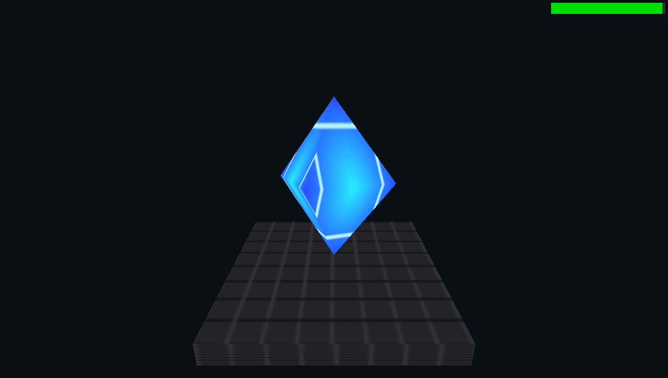
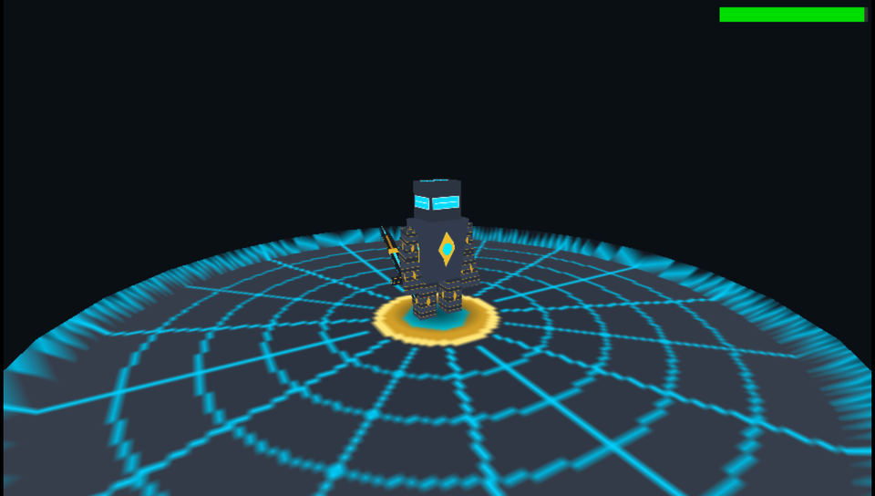

# Tutorial: Procedural & Hierarchical 3D Animation 💎⚔️

This tutorial explains how to implement 3D animations on the Sony PSP leveraging the hardware matrix stack (`pspgum`), procedural kinematics, and high-performance mathematics—targeting smooth 60 FPS without overloading the 333 MHz MIPS CPU.

Two complete showcase demos are included in PSP-Forge:
1. **Procedural Floating Gem**: `demos/demo_anim_3d/` (Harmonic oscillations, tilt, and continuous rotation)
2. **Hierarchical Humanoid Knight**: `demos/demo_anim_3d_v2/` (Full articulated humanoid rig with walk cycle, jump, attack, and arena)

---

## 1. Why Hierarchical & Procedural Animation on PSP?

The Sony PSP features a Vector Floating Point Unit (VFPU) and a dedicated Graphics Engine (GE) coupled with the `pspgum` transformation matrix stack library.

Processing skeletal deformation with per-vertex weights on the CPU (*software vertex skinning*) requires multiplying dozens of matrices for thousands of vertices every frame. On the PSP's 333 MHz MIPS R4000-based CPU with limited cache lines, this causes severe frame drops.

Commercial PSP titles (and classic PS1/N64 era games) solve this elegantly with two techniques:
1. **Procedural Transforms**: Harmonic sinusoidal functions ($\sin$, $\cos$) for bobbing, rolling, floating, and breathing.
2. **Hierarchical Matrix Cascades**: Splitting a character into modular rigid meshes (torso, head, upper arm, forearm, thigh, shin, weapon) connected via nested `sceGumPushMatrix()` and `sceGumPopMatrix()` calls. The PSP's Allegrex VFPU performs rapid matrix multiplications in hardware vector registers, while the Graphics Engine transforms vertex coordinates by uploaded modelview matrices during hardware rendering!

---

## 2. Part 1: Procedural Floating Object (`demo_anim_3d`)

<div align="center">
  
  <p><em>Procedural 3D floating crystal with sinusoidal bobbing, harmonic tilt, and continuous rotation.</em></p>
</div>

### A. Mathematical Foundations
- **Vertical oscillation (bobbing)**:
  $$Y(t) = Y_0 + \sin(t \cdot \omega_{\text{bob}}) \cdot A_{\text{bob}}$$
- **Dynamic harmonic tilt**:
  $$\theta_x(t) = \cos(t \cdot \omega_{\text{tilt}}) \cdot A_{\text{tilt}}$$
- **Continuous spin**:
  $$R_y(t) = t \cdot \text{speed}$$

### B. Implementation in Game Loop
```c
float dt = forge_get_delta_time();
time_acc += dt;

// 1. Compute procedural trajectory
float gem_bob_y = sinf(time_acc * 2.5f) * 0.35f;
float gem_rot_y = time_acc * 2.0f;
float gem_tilt  = cosf(time_acc * 1.5f) * 0.15f;

// 2. Setup camera orbit
float cam_x = sinf(cam_angle) * cam_dist;
float cam_z = -cosf(cam_angle) * cam_dist;

// 3. Render base and animated crystal inside display list
forge_begin_frame();
forge_clear(0xFF140F0A);
forge_set_camera(cam_x, cam_height, cam_z, 0.0f, 0.0f, 0.0f, 60.0f);

forge_draw_mesh(ped_mesh, ped_tex, 0.0f, 0.0f, 0.0f, 0.0f, 0.0f, 0.0f, 1.0f, 1.0f, 1.0f);
forge_draw_mesh(gem_mesh, gem_tex,
    0.0f, 0.5f + gem_bob_y, 0.0f,
    gem_tilt, gem_rot_y, 0.0f,
    1.0f, 1.0f, 1.0f
);

forge_end_frame();
```

---

## 3. Part 2: Articulated Humanoid Rig (`demo_anim_3d_v2`)

In `demo_anim_3d_v2`, we construct an interactive humanoid cyber-knight walking inside a 3D circular arena.

<div align="center">
  
  <p><em>Articulated humanoid rig with pspgum matrix cascade, sword slash, and interactive locomotion at 60 FPS.</em></p>
</div>

### A. Modular Mesh Design & Pivot Points
To allow limbs to rotate naturally around joints (shoulders, elbows, hips, knees), modular meshes must be modeled with their **pivot point at $(0, 0, 0)$**:

| Mesh Asset | Description | Pivot Position |
|---|---|---|
| `torso.obj` | Chest and spine | Base of waist / hips $(0, 0, 0)$ extending up to $Y = 0.85$ |
| `head.obj` | Helmet with glowing visor | Base of neck $(0, 0, 0)$ |
| `limb.obj` | Articulated capsule / beveled segment | Top joint $(0, 0, 0)$ extending downward along $-Y$ |
| `sword.obj` | Energy blade and crossguard | Center of the hilt |
| `arena.obj` | Circular arena floor disc | Center of the arena $(0, 0, 0)$ |
| `shadow_disc.obj` | Ground contact shadow polygon | Center of the ground contact |

> [!TIP]
> **Reusing Meshes**: The single `limb.obj` asset is reused for all 8 limb segments: Left/Right Upper Arms, Left/Right Forearms, Left/Right Thighs, and Left/Right Shins. Different joint proportions are created simply by passing different scale factors (`sx, sy, sz`).

### B. Texture Budgeting
- `knight_bot.png` ($256 \times 256$, 256 KB): UV atlas for armor, visor, and sword.
- `arena.png` ($128 \times 128$, 64 KB): Radial stone pattern with glowing cyan circuit runes.
- `shadow.png` ($64 \times 64$, 16 KB): Soft radial alpha vignette.
Total texture memory: ~336 KB loaded in RAM, well within the PSP's memory footprint! (Can also be loaded directly to the 688 KiB eDRAM texture scratchpad via `forge_texture_load_vram`).

---

## 4. The Hierarchical Matrix Tree
 
By chaining matrix transformations, child nodes automatically inherit the world position, rotation, and jump height of their parents:

```text
World Space
 ├── Arena Floor (static at 0, 0, 0)
 ├── Contact Shadow Disc (world-space at Y = 0.015, dynamic scale based on jump height)
 └── Knight Root (Pos X, Jump Y, Pos Z, Facing Angle)
      └── Torso (breathing Y bob + forward lean during run)
           ├── Head (neck offset Y = 0.85 + head pitch)
           ├── Left Shoulder -> Left Upper Arm -> Left Forearm
           ├── Right Shoulder -> Right Upper Arm -> Right Forearm -> Hand (Sword)
           ├── Left Hip -> Left Thigh -> Left Shin
           └── Right Hip -> Right Thigh -> Right Shin
```

### C99 Hierarchical Drawing Implementation
In `demo_anim_3d_v2`, the articulated humanoid is drawn using `forge_draw_mesh_current()` alongside `pspgum` matrix operations:

```c
// Example: Attaching Head and Left Arm to Torso (from demos/demo_anim_3d_v2/src/main.c)
sceGumPushMatrix();
{
    // 1. Move to Character Root and apply facing yaw
    ScePspFVector3 root_pos = { char_x, char_y, char_z };
    ScePspFVector3 root_rot = { 0.0f, facing_angle, 0.0f };
    sceGumTranslate(&root_pos);
    sceGumRotateXYZ(&root_rot);

    // 2. Draw Torso (with subtle breathing oscillation)
    sceGumPushMatrix();
    {
        ScePspFVector3 torso_pos = { 0.0f, torso_bob_y, 0.0f };
        ScePspFVector3 torso_rot = { torso_pitch, 0.0f, 0.0f };
        sceGumTranslate(&torso_pos);
        sceGumRotateXYZ(&torso_rot);

        // Draw chest mesh at current matrix
        forge_draw_mesh_current(torso_mesh, bot_tex);

        // Child: Head (attached at neck Y = 0.85)
        sceGumPushMatrix();
        {
            ScePspFVector3 head_off = { 0.0f, 0.85f, 0.0f };
            sceGumTranslate(&head_off);
            sceGumRotateX(head_pitch);
            forge_draw_mesh_current(head_mesh, bot_tex);
        }
        sceGumPopMatrix();

        // Child: Left Arm (shoulder attached at X = -0.42, Y = 0.75)
        sceGumPushMatrix();
        {
            ScePspFVector3 l_shldr = { -0.42f, 0.75f, 0.0f };
            sceGumTranslate(&l_shldr);
            sceGumRotateX(l_arm_swing);

            // Upper arm
            ScePspFVector3 arm_scale = { 0.85f, 0.75f, 0.85f };
            sceGumScale(&arm_scale);
            forge_draw_mesh_current(limb_mesh, bot_tex);

            // Forearm (elbow joint at Y = -0.52)
            ScePspFVector3 elbow_off = { 0.0f, -0.52f, 0.0f };
            sceGumTranslate(&elbow_off);
            sceGumRotateX(l_forearm_rx);
            forge_draw_mesh_current(limb_mesh, bot_tex);
        }
        sceGumPopMatrix();

        // (Similar hierarchical branches for Right Arm + Sword, Left Leg, Right Leg...)
    }
    sceGumPopMatrix();
}
sceGumPopMatrix();
```

---

## 5. Locomotion State Machine

`demo_anim_3d_v2` includes an interactive locomotion controller:

### A. Idle State
- **Breathing**: Sinusoidal chest bobbing:
  $$\text{torso\_bob\_y} = \sin(\text{phase}) \cdot 0.035\text{ m}, \quad \text{where } \text{phase} \mathrel{+}= dt \cdot 2.5$$
- **Arm Rest**: Arms hang relaxed with subtle breathing counter-motion.

### B. Walk / Run Gait
- **Leg Swing (Forward Kinematics)**:
  $$\theta_{\text{thigh\_left}} = \sin(\text{anim\_phase}) \cdot 0.75\text{ rad}$$
  $$\theta_{\text{thigh\_right}} = -\theta_{\text{thigh\_left}}$$
- **Knee Hinge Bend**:
  $$\theta_{\text{knee\_left}} = (\theta_{\text{thigh\_left}} < 0) \,?\, (-\theta_{\text{thigh\_left}} \cdot 0.9) : 0.0$$
- **Arm Swing**: Swings in reciprocal counter-phase to balance torso momentum.

### C. Ballistic Jump
- Triggered with Cross ($\times$):
  $$V_y = 5.8\text{ m/s}$$
  $$Y(t) \mathrel{+}= V_y \cdot dt, \quad V_y \mathrel{-}= 16.0 \cdot dt$$
- **Airborne pose**: Asymmetric athletic jump pose ($\theta_{\text{thigh\_left}} = 0.5$, $\theta_{\text{thigh\_right}} = -0.4$, $\theta_{\text{knee\_left}} = 0.6$, $\theta_{\text{knee\_right}} = 0.8$).
- **Dynamic ground shadow**: Scales inversely with altitude:
  $$S = \max\left(0.25, \; \frac{1.0}{1.0 + Y \cdot 1.2}\right)$$

### D. Sword Slash Attack
- Triggered with Square ($\square$):
  - Right arm raises and executes a wide $3.8\text{ rad}$ downward slash arc (sweeping from $-2.2\text{ rad}$ back swing to $+1.6\text{ rad}$ follow-through).
  - Torso twists and dips dynamically into the strike.

---

## 6. Part 3: Skeletal Skinning & glTF Animation (`demo_anim_skeletal`)

While hierarchical rigid models (Mode A) work wonderfully for armored knights and robots, organic characters (such as humanoids with clothing, anime characters, or creatures) require **smooth continuous skinning** across joints (Mode B).

PSP-Forge provides a complete automated glTF skeletal pipeline:

```text
3D Rigged Model (glTF / GLB)
     │
     ├── Triangle Clustering (cli/cookers/gltf.py)
     │    └── Subdivides mesh into sub-chunks referencing <= 8 local bones
     │
     ├── Material Atlas Fusion
     │    └── Packs multiple materials into one 512x512 texture & remaps UVs
     │
     ├── Auto-Chroma Keying
     │    └── Detects solid neutral matte background of facial features -> transparent
     │
     └── Animation Baking (.panm)
          └── Samples keyframes at 30 FPS, compresses to 16-byte fixed samples
```

### Mode A vs Mode B Comparison

| Feature | Mode A (Rigid Hierarchical) | Mode B (Skinned Mesh Chunks) |
|---|---|---|
| **Best suited for** | Mechas, segmented armor, vehicles, robots | Humans, organic creatures, cloth, hair |
| **Joint Deformation** | Rigid mesh per node (no bending at vertices) | Smooth vertex blending (`GU_WEIGHTS`) |
| **Bone Limit** | Arbitrary tree depth (uses `pspgum` stack) | Up to 96 bones in skeleton, $\le 8$ per chunk |
| **GPU Execution** | Single world transform per draw call | Up to 8 bone matrices loaded to `sceGuBoneMatrix` |
| **Asset Format** | Separate `.obj` / `.p3d` files per limb | Single unified `.p3d` (P3D2 multi-chunk) |
| **Implementation** | `forge_draw_mesh_node()` or `pspgum` cascade | `forge_model3d_draw(model, &animator, tex)` |

### Practical Code Example: Skeletal Character Loop
```c
// 1. Load cooked assets
ForgeModel3D* model = forge_model3d_load("assets/character.p3d");
ForgeTexture* tex   = forge_texture_load("assets/character.tex");
ForgeAnimClip* clip = forge_anim3d_load("assets/character_walk.panm");

// 2. Initialize animator
ForgeAnimator anim;
forge_anim3d_init(&anim);
forge_anim3d_play(&anim, clip, true);

// 3. Enable hardware alpha testing for eyelashes/eyes/hair cutouts
forge_set_alpha_test(true, 128);

// Inside 60 FPS frame loop:
float dt = forge_get_delta_time();
forge_anim3d_update(&anim, model, dt);

// Camera-relative controls:
// Calculate movement vector aligned with camera orbital angle
float move_x = input.analog_x * cosf(cam_angle) - input.analog_y * sinf(cam_angle);
float move_z = input.analog_x * sinf(cam_angle) + input.analog_y * cosf(cam_angle);

sceGumPushMatrix();
{
    ScePspFVector3 pos = { char_x, char_y, char_z };
    ScePspFVector3 rot = { 0.0f, facing_angle, 0.0f };
    sceGumTranslate(&pos);
    sceGumRotateXYZ(&rot);

    forge_model3d_draw(model, &anim, tex);
}
sceGumPopMatrix();
```

---

## 7. Hardware Rasterizer & Frustum Clipping Tip

> [!WARNING]
> **PSP Near-Plane Geometry Discard ($W \le 0$)**:  
> The PSP's hardware rasterizer discards any triangle whose vertices extend behind the camera's near clipping plane ($Z_{\text{near}} \approx 0.5$).
> If a large arena floor extends past the camera's eye position, triangular wedges will visibly pop out of view.
> 
> **Solution**: Keep ground arenas sized appropriately (e.g. radius $R \approx 4.5$ with camera distance $D \approx 5.8$ to $6.2$), or subdivide large ground floors into smaller tiles so the GPU can clip individual small polygons cleanly.

---

## 8. Building and Running the Demos

### Run Demo 1 (Floating Gem):
```bash
cd demos/demo_anim_3d
psp-forge cook
psp-forge build
psp-forge run
```

### Run Demo 2 (Humanoid Cyber-Knight):
```bash
cd demos/demo_anim_3d_v2
psp-forge cook
psp-forge build
psp-forge run
```

### Interactive Controls (Demo V2 & Skeletal Demo):
| Button | Action |
|---|---|
| **Analog Stick / D-Pad** | Walk & Run across the 3D arena (Camera-relative) |
| **Cross ($\times$)** | Ballistic Jump with dynamic shadow scaling |
| **Square ($\square$)** | Energy Sword Slash combo |
| **L / R Triggers** | Smooth 360° Orbiting Camera |
| **Start** | Reset position to center |

