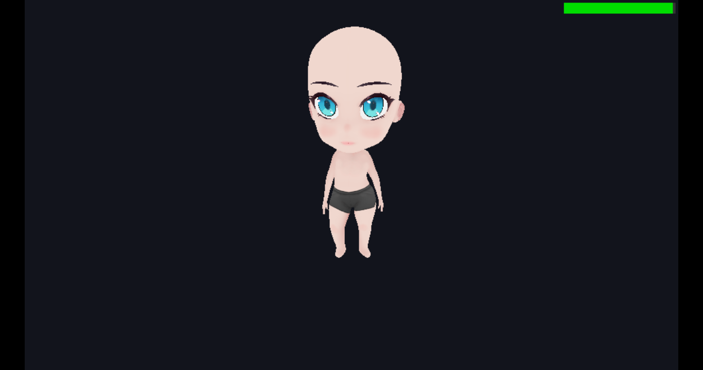

# Tutorial: 3D Animation (Procedural, Hierarchical & Skeletal Skinning) 💎⚔️

This tutorial explains how to implement 3D animations on the Sony PSP leveraging the hardware matrix stack (`pspgum`), procedural kinematics, high-performance mathematics, and hardware vertex skinning—targeting smooth 60 FPS without overloading the 333 MHz MIPS CPU.

Three complete showcase demos are included in PSP-Forge:
1. **Procedural Floating Gem**: `demos/demo_anim_3d/` (Harmonic oscillations, tilt, and continuous rotation)
2. **Hierarchical Humanoid Knight**: `demos/demo_anim_3d_v2/` (Full articulated humanoid rig with walk cycle, jump, attack, and arena)
3. **Continuous Skeletal Humanoid**: `demos/demo_anim_skeletal/` (glTF/GLB asset cooking, bone palettes, multi-chunk skinning, multi-clip state machine, camera-relative locomotion)

---

## 1. Why Hierarchical & Procedural Animation on PSP?

The Sony PSP features a Vector Floating Point Unit (VFPU) and a dedicated Graphics Engine (GE) coupled with the `pspgum` transformation matrix stack library.

Processing skeletal deformation with per-vertex weights on the CPU (*software vertex skinning*) requires multiplying dozens of matrices for thousands of vertices every frame. On the PSP's 333 MHz MIPS R4000-based CPU with limited cache lines, this causes severe frame drops.

Commercial PSP titles (and classic PS1/N64 era games) solve this elegantly with two techniques:
1. **Procedural Transforms**: Harmonic sinusoidal functions ($\sin$, $\cos$) for bobbing, rolling, floating, and breathing.
2. **Hierarchical Matrix Cascades**: Splitting a character into modular rigid meshes (torso, head, upper arm, forearm, thigh, shin, weapon) connected via nested `sceGumPushMatrix()` and `sceGumPopMatrix()` calls. The PSP's Allegrex VFPU performs rapid matrix multiplications in hardware vector registers, while the Graphics Engine transforms vertex coordinates by uploaded modelview matrices during hardware rendering!

---

## 2. Part 1: Procedural Floating Object (`demo_anim_3d`)

<div align="center">
  
  <p><em>Procedural 3D floating crystal with sinusoidal bobbing, harmonic tilt, and continuous rotation.</em></p>
</div>

### A. Mathematical Foundations
- **Vertical oscillation (bobbing)**:
  $$Y(t) = Y_0 + \sin(t \cdot \omega_{\text{bob}}) \cdot A_{\text{bob}}$$
- **Dynamic harmonic tilt**:
  $$\theta_x(t) = \cos(t \cdot \omega_{\text{tilt}}) \cdot A_{\text{tilt}}$$
- **Continuous spin**:
  $$R_y(t) = t \cdot \text{speed}$$

### B. Implementation in Game Loop
```c
float dt = forge_get_delta_time();
time_acc += dt;

// 1. Compute procedural trajectory
float gem_bob_y = sinf(time_acc * 2.5f) * 0.35f;
float gem_rot_y = time_acc * 2.0f;
float gem_tilt  = cosf(time_acc * 1.5f) * 0.15f;

// 2. Setup camera orbit
float cam_x = sinf(cam_angle) * cam_dist;
float cam_z = -cosf(cam_angle) * cam_dist;

// 3. Render base and animated crystal inside display list
forge_begin_frame();
forge_clear(0xFF140F0A);
forge_set_camera(cam_x, cam_height, cam_z, 0.0f, 0.0f, 0.0f, 60.0f);

forge_draw_mesh(ped_mesh, ped_tex, 0.0f, 0.0f, 0.0f, 0.0f, 0.0f, 0.0f, 1.0f, 1.0f, 1.0f);
forge_draw_mesh(gem_mesh, gem_tex,
    0.0f, 0.5f + gem_bob_y, 0.0f,
    gem_tilt, gem_rot_y, 0.0f,
    1.0f, 1.0f, 1.0f
);

forge_end_frame();
```

---

## 3. Part 2: Articulated Humanoid Rig (`demo_anim_3d_v2`)

In `demo_anim_3d_v2`, we construct an interactive humanoid cyber-knight walking inside a 3D circular arena.

<div align="center">
  
  <p><em>Articulated humanoid rig with pspgum matrix cascade, sword slash, and interactive locomotion at 60 FPS.</em></p>
</div>

### A. Modular Mesh Design & Pivot Points
To allow limbs to rotate naturally around joints (shoulders, elbows, hips, knees), modular meshes must be modeled with their **pivot point at $(0, 0, 0)$**:

| Mesh Asset | Description | Pivot Position |
|---|---|---|
| `torso.obj` | Chest and spine | Base of waist / hips $(0, 0, 0)$ extending up to $Y = 0.85$ |
| `head.obj` | Helmet with glowing visor | Base of neck $(0, 0, 0)$ |
| `limb.obj` | Articulated capsule / beveled segment | Top joint $(0, 0, 0)$ extending downward along $-Y$ |
| `sword.obj` | Energy blade and crossguard | Center of the hilt |
| `arena.obj` | Circular arena floor disc | Center of the arena $(0, 0, 0)$ |
| `shadow_disc.obj` | Ground contact shadow polygon | Center of the ground contact |

> [!TIP]
> **Reusing Meshes**: The single `limb.obj` asset is reused for all 8 limb segments: Left/Right Upper Arms, Left/Right Forearms, Left/Right Thighs, and Left/Right Shins. Different joint proportions are created simply by passing different scale factors (`sx, sy, sz`).

### B. Texture Budgeting
- `knight_bot.png` ($256 \times 256$, 256 KB): UV atlas for armor, visor, and sword.
- `arena.png` ($128 \times 128$, 64 KB): Radial stone pattern with glowing cyan circuit runes.
- `shadow.png` ($64 \times 64$, 16 KB): Soft radial alpha vignette.
Total texture memory: ~336 KB loaded in RAM, well within the PSP's memory footprint! (Can also be loaded directly to the 688 KiB eDRAM texture scratchpad via `forge_texture_load_vram`).

---

## 4. The Hierarchical Matrix Tree
 
By chaining matrix transformations, child nodes automatically inherit the world position, rotation, and jump height of their parents:

```text
World Space
 ├── Arena Floor (static at 0, 0, 0)
 ├── Contact Shadow Disc (world-space at Y = 0.015, dynamic scale based on jump height)
 └── Knight Root (Pos X, Jump Y, Pos Z, Facing Angle)
      └── Torso (breathing Y bob + forward lean during run)
           ├── Head (neck offset Y = 0.85 + head pitch)
           ├── Left Shoulder -> Left Upper Arm -> Left Forearm
           ├── Right Shoulder -> Right Upper Arm -> Right Forearm -> Hand (Sword)
           ├── Left Hip -> Left Thigh -> Left Shin
           └── Right Hip -> Right Thigh -> Right Shin
```

### C99 Hierarchical Drawing Implementation
In `demo_anim_3d_v2`, the articulated humanoid is drawn using `forge_draw_mesh_current()` alongside `pspgum` matrix operations:

```c
// Example: Attaching Head and Left Arm to Torso (from demos/demo_anim_3d_v2/src/main.c)
sceGumPushMatrix();
{
    // 1. Move to Character Root and apply facing yaw
    ScePspFVector3 root_pos = { char_x, char_y, char_z };
    ScePspFVector3 root_rot = { 0.0f, facing_angle, 0.0f };
    sceGumTranslate(&root_pos);
    sceGumRotateXYZ(&root_rot);

    // 2. Draw Torso (with subtle breathing oscillation)
    sceGumPushMatrix();
    {
        ScePspFVector3 torso_pos = { 0.0f, torso_bob_y, 0.0f };
        ScePspFVector3 torso_rot = { torso_pitch, 0.0f, 0.0f };
        sceGumTranslate(&torso_pos);
        sceGumRotateXYZ(&torso_rot);

        // Draw chest mesh at current matrix
        forge_draw_mesh_current(torso_mesh, bot_tex);

        // Child: Head (attached at neck Y = 0.85)
        sceGumPushMatrix();
        {
            ScePspFVector3 head_off = { 0.0f, 0.85f, 0.0f };
            sceGumTranslate(&head_off);
            sceGumRotateX(head_pitch);
            forge_draw_mesh_current(head_mesh, bot_tex);
        }
        sceGumPopMatrix();

        // Child: Left Arm (shoulder attached at X = -0.42, Y = 0.75)
        sceGumPushMatrix();
        {
            ScePspFVector3 l_shldr = { -0.42f, 0.75f, 0.0f };
            sceGumTranslate(&l_shldr);
            sceGumRotateX(l_arm_swing);

            // Upper arm
            ScePspFVector3 arm_scale = { 0.85f, 0.75f, 0.85f };
            sceGumScale(&arm_scale);
            forge_draw_mesh_current(limb_mesh, bot_tex);

            // Forearm (elbow joint at Y = -0.52)
            ScePspFVector3 elbow_off = { 0.0f, -0.52f, 0.0f };
            sceGumTranslate(&elbow_off);
            sceGumRotateX(l_forearm_rx);
            forge_draw_mesh_current(limb_mesh, bot_tex);
        }
        sceGumPopMatrix();

        // (Similar hierarchical branches for Right Arm + Sword, Left Leg, Right Leg...)
    }
    sceGumPopMatrix();
}
sceGumPopMatrix();
```

---

## 5. Locomotion State Machine

`demo_anim_3d_v2` includes an interactive locomotion controller:

### A. Idle State
- **Breathing**: Sinusoidal chest bobbing:
  $$\text{torso\_bob\_y} = \sin(\text{phase}) \cdot 0.035\text{ m}, \quad \text{where } \text{phase} \mathrel{+}= dt \cdot 2.5$$
- **Arm Rest**: Arms hang relaxed with subtle breathing counter-motion.

### B. Walk / Run Gait
- **Leg Swing (Forward Kinematics)**:
  $$\theta_{\text{thigh\_left}} = \sin(\text{anim\_phase}) \cdot 0.75\text{ rad}$$
  $$\theta_{\text{thigh\_right}} = -\theta_{\text{thigh\_left}}$$
- **Knee Hinge Bend**:
  $$\theta_{\text{knee\_left}} = (\theta_{\text{thigh\_left}} < 0) \,?\, (-\theta_{\text{thigh\_left}} \cdot 0.9) : 0.0$$
- **Arm Swing**: Swings in reciprocal counter-phase to balance torso momentum.

### C. Ballistic Jump
- Triggered with Cross ($\times$):
  $$V_y = 5.8\text{ m/s}$$
  $$Y(t) \mathrel{+}= V_y \cdot dt, \quad V_y \mathrel{-}= 16.0 \cdot dt$$
- **Airborne pose**: Asymmetric athletic jump pose ($\theta_{\text{thigh\_left}} = 0.5$, $\theta_{\text{thigh\_right}} = -0.4$, $\theta_{\text{knee\_left}} = 0.6$, $\theta_{\text{knee\_right}} = 0.8$).
- **Dynamic ground shadow**: Scales inversely with altitude:
  $$S = \max\left(0.25, \; \frac{1.0}{1.0 + Y \cdot 1.2}\right)$$

### D. Sword Slash Attack
- Triggered with Square ($\square$):
  - Right arm raises and executes a wide $3.8\text{ rad}$ downward slash arc (sweeping from $-2.2\text{ rad}$ back swing to $+1.6\text{ rad}$ follow-through).
  - Torso twists and dips dynamically into the strike.

---

## 6. Part 3: Continuous Skeletal Animation (`demo_anim_skeletal`)

<div align="center">
  
  <p><em>Continuous skeletal skinning with hardware bone blending, multi-clip animation player, and camera-relative locomotion at 60 FPS.</em></p>
</div>

While hierarchical rigid models (Mode A) work wonderfully for armored knights and mechas, organic characters (such as humanoids with clothing, anime characters, or creatures) require **smooth continuous skinning** across joints (Mode B).

---

### Step-by-Step Guide: Reproducing the Skeletal Demo from Scratch

Here is the exact step-by-step workflow to reproduce this 3D skeletal character demo in a brand new project using only `psp-forge` CLI commands and standard C99 code.

#### Step 1: Scaffold a New Project
Run `psp-forge init` with the `--template 3d` flag:
```bash
psp-forge init my_skeletal_demo --template 3d
cd my_skeletal_demo
```
This generates the project folder structure with `CMakeLists.txt`, `psp.toml`, and the `assets/` directory.

#### Step 2: Prepare your 3D Rigged Character (`.glb` / `.gltf`)
Copy your rigged glTF or binary GLB file into `assets/` (for example, named `character.glb`):
```bash
cp /path/to/character.glb assets/character.glb
```

> [!IMPORTANT]
> **glTF Asset Requirements & Limits**:
> 1. **Bone Count**: The skeleton must not exceed **96 bones** (`FORGE_MAX_BONES = 96`). Most humanoids with fingers and face bones use between 40 and 78 bones.
> 2. **Vertex Weights**: Each vertex should have at most 4 active joint influences in glTF (`JOINTS_0`, `WEIGHTS_0`).
> 3. **Materials**: Multiple materials and embedded textures are supported! The cooker automatically packs them into a single $512 \times 512$ master texture atlas with UV remapping.

#### Step 3: Cook the Assets with `psp-forge cook`
Run the asset cooker:
```bash
psp-forge cook
```

The cooker executes the following hardware transformations automatically:
1. **Mesh Chunking**: Scans all triangles. Whenever a cluster of triangles references more than 8 unique bones, it splits the geometry into separate sub-mesh chunks, each referencing $\le 8$ local bones.
2. **Bone Palette Mapping**: Writes a local 8-byte palette (`bone_palette[8]`) into each chunk header and remaps vertex bone weight slots to indices `0..7`.
3. **Material Atlas Fusion**: Fuses multiple material textures into `build/assets/character.tex` ($512 \times 512$ swizzled POT format) and recalculates the UV coordinates for all vertices.
4. **Auto-Chroma Keying**: Scans textures for solid neutral backgrounds (e.g., solid gray around eyelashes or eyebrows) and converts them to transparent alpha (`A = 0`).
5. **Animation Baking**: Detects all animation tracks inside the GLB (e.g., `iddle`, `walk`, `run`, `jump`, `flip`) and compiles each into a separate compressed binary file:
   - `build/assets/character.p3d` (P3D2 Multi-Chunk model)
   - `build/assets/character.tex` (Fused texture atlas)
   - `build/assets/character_anim_<name>.panm` (Baked 30 FPS animation clips)

#### Step 4: Write the C99 Game Engine Code (`src/main.c`)
Replace the contents of `src/main.c` with the following implementation:

```c
#include <psp_forge.h>
#include <stdio.h>
#include <math.h>

PSP_MODULE_INFO("MY_SKELETAL_DEMO", 0, 1, 0);
PSP_MAIN_THREAD_ATTR(THREAD_ATTR_USER | THREAD_ATTR_VFPU);

typedef enum {
    STATE_IDLE = 0,
    STATE_WALK,
    STATE_RUN,
    STATE_ACTION
} CharacterState;

int main(int argc, char* argv[]) {
    // 1. Initialize base directory and PSP-Forge engine
    if (argc > 0 && argv && argv[0]) {
        forge_set_base_path(argv[0]);
    }
    forge_init(0);

    // 2. Load 3D Skeletal Model and Fused Texture Atlas
    ForgeModel3D* model = forge_model3d_load("assets/character.p3d");
    ForgeTexture* tex   = forge_texture_load("assets/character.tex");

    // 3. Enable Hardware Alpha Testing for eye/hair transparent cutouts
    forge_set_alpha_test(true, 0x20);

    // 4. Load Baked Animation Clips (.panm)
    ForgeAnimClip* clip_idle = forge_anim3d_load("assets/character_anim_iddle.panm");
    ForgeAnimClip* clip_walk = forge_anim3d_load("assets/character_anim_walk.panm");
    ForgeAnimClip* clip_run  = forge_anim3d_load("assets/character_anim_run.panm");
    ForgeAnimClip* clip_jump = forge_anim3d_load("assets/character_anim_jump.panm");
    ForgeAnimClip* clip_flip = forge_anim3d_load("assets/character_anim_flip.panm");

    // 5. Initialize Animator and Play Default Idle Animation
    ForgeAnimator animator;
    forge_anim3d_init(&animator);
    if (clip_idle) {
        forge_anim3d_play(&animator, clip_idle, true);
    }

    // 6. Setup Directional / Ambient Lighting
    forge_set_light(0,  0.0f,  5.0f, -3.0f, 0xFFFFFFFF, 2.5f);
    forge_set_light(1,  3.0f,  2.0f,  4.0f, 0xFF80B0FF, 1.8f);
    sceGuAmbient(0xFF383838);

    // Character locomotion & Camera orbit state
    CharacterState state = STATE_IDLE;
    float char_x = 0.0f, char_y = 0.0f, char_z = 0.0f, char_yaw = 0.0f;
    float cam_dist = 3.2f, cam_yaw = 3.14159f, cam_pitch = 0.35f;

    ForgeInput in;

    while (forge_is_running()) {
        forge_input_poll(&in);
        float dt = forge_get_delta_time();

        // --- Camera Orbit Controls (L / R Triggers) ---
        if (forge_input_is_held(&in, PSP_CTRL_LTRIGGER)) cam_yaw -= 2.0f * dt;
        if (forge_input_is_held(&in, PSP_CTRL_RTRIGGER)) cam_yaw += 2.0f * dt;

        // --- Analog Stick / D-Pad Movement Input ---
        float move_x = in.analog_x;
        float move_y = in.analog_y;
        if (forge_input_is_held(&in, PSP_CTRL_LEFT))  move_x = -1.0f;
        if (forge_input_is_held(&in, PSP_CTRL_RIGHT)) move_x =  1.0f;
        if (forge_input_is_held(&in, PSP_CTRL_UP))    move_y = -1.0f;
        if (forge_input_is_held(&in, PSP_CTRL_DOWN))  move_y =  1.0f;

        float move_len = sqrtf(move_x * move_x + move_y * move_y);
        if (move_len > 1.0f) {
            move_x /= move_len;
            move_y /= move_len;
            move_len = 1.0f;
        }

        // --- Action Triggers (Cross = Jump, Square = Flip) ---
        if (forge_input_is_pressed(&in, PSP_CTRL_CROSS) && state != STATE_ACTION) {
            if (clip_jump) {
                state = STATE_ACTION;
                forge_anim3d_play(&animator, clip_jump, false);
            }
        } else if (forge_input_is_pressed(&in, PSP_CTRL_SQUARE) && state != STATE_ACTION) {
            if (clip_flip) {
                state = STATE_ACTION;
                forge_anim3d_play(&animator, clip_flip, false);
            }
        }

        // --- State Machine & Camera-Relative Locomotion ---
        if (state == STATE_ACTION) {
            if (animator.finished) {
                state = STATE_IDLE;
                if (clip_idle) forge_anim3d_play(&animator, clip_idle, true);
            }
        } else {
            if (move_len > 0.15f) {
                // Orient movement relative to current camera orbital yaw
                float sin_cam = sinf(cam_yaw);
                float cos_cam = cosf(cam_yaw);
                float world_move_x = (-move_x * cos_cam + move_y * sin_cam);
                float world_move_z = (-move_x * sin_cam - move_y * cos_cam);

                float speed = (move_len > 0.6f) ? 2.4f : 1.2f;
                if (move_len > 0.6f) {
                    if (state != STATE_RUN && clip_run) {
                        state = STATE_RUN;
                        forge_anim3d_play(&animator, clip_run, true);
                    }
                } else {
                    if (state != STATE_WALK && clip_walk) {
                        state = STATE_WALK;
                        forge_anim3d_play(&animator, clip_walk, true);
                    }
                }

                char_x += world_move_x * speed * dt;
                char_z += world_move_z * speed * dt;

                // Smooth facing rotation towards motion angle
                float target_yaw = atan2f(world_move_x, world_move_z);
                float angle_diff = target_yaw - char_yaw;
                while (angle_diff >  3.14159f) angle_diff -= 6.28318f;
                while (angle_diff < -3.14159f) angle_diff += 6.28318f;
                char_yaw += angle_diff * 14.0f * dt;
            } else {
                if (state != STATE_IDLE && clip_idle) {
                    state = STATE_IDLE;
                    forge_anim3d_play(&animator, clip_idle, true);
                }
            }
        }

        // --- Forward Kinematics Update ---
        forge_anim3d_update(&animator, model, dt);

        // --- Compute Orbiting Camera Position ---
        float cam_eye_x = char_x + sinf(cam_yaw) * cosf(cam_pitch) * cam_dist;
        float cam_eye_y = char_y + sinf(cam_pitch) * cam_dist + 0.8f;
        float cam_eye_z = char_z - cosf(cam_yaw) * cosf(cam_pitch) * cam_dist;

        // --- Render Frame ---
        forge_begin_frame();
        forge_clear(0xFF1C1412); // Midnight slate background

        forge_set_camera(
            cam_eye_x, cam_eye_y, cam_eye_z,
            char_x, char_y + 0.8f, char_z,
            60.0f
        );

        if (model) {
            sceGumMatrixMode(GU_MODEL);
            sceGumLoadIdentity();

            ScePspFVector3 root_pos = { char_x, char_y, char_z };
            sceGumTranslate(&root_pos);
            sceGumRotateY(char_yaw);

            // Dispatches all sub-chunks with hardware bone skinning
            forge_model3d_draw(model, &animator, tex);
        }

        forge_end_frame();
    }

    // 7. Cleanup Resources
    if (clip_idle) forge_anim3d_free(clip_idle);
    if (clip_walk) forge_anim3d_free(clip_walk);
    if (clip_run)  forge_anim3d_free(clip_run);
    if (clip_jump) forge_anim3d_free(clip_jump);
    if (clip_flip) forge_anim3d_free(clip_flip);
    if (model)     forge_model3d_free(model);
    if (tex)       forge_texture_free(tex);

    forge_shutdown();
    sceKernelExitGame();
    return 0;
}
```

#### Step 5: Build and Run
Compile and test the project:
```bash
# Build native MIPS EBOOT.PBP
psp-forge build

# Run in PPSSPP
psp-forge run
```

---

### Key Architectural Details Explained

#### 1. Why `forge_set_alpha_test(true, 0x20)` is Essential
Modern 3D characters often model eyelashes, eyebrows, and hair tips as semi-transparent quads mapped over the face geometry.
- If you use alpha blending (`GU_BLEND`), polygons must be sorted back-to-front on the Allegrex CPU every frame; otherwise, a quad drawn first will write to the depth buffer and occlude the eye beneath it.
- `forge_set_alpha_test(true, 0x20)` configures the PSP Graphics Engine to **discard** any pixel with alpha $< 32$ *before* writing to the depth buffer. Discarded pixels do not update the Z-buffer, meaning the eye underneath renders perfectly without any CPU sorting!

#### 2. Camera-Relative Movement
When the camera rotates around the character, pressing "Up" on the analog stick should always move the character *away from the camera*, not along the absolute world $Z$ axis.
The coordinate transformation uses the camera orbital yaw ($\theta_{\text{cam}}$):
$$\Delta X = -\text{move}_x \cdot \cos(\theta_{\text{cam}}) + \text{move}_y \cdot \sin(\theta_{\text{cam}})$$
$$\Delta Z = -\text{move}_x \cdot \sin(\theta_{\text{cam}}) - \text{move}_y \cdot \cos(\theta_{\text{cam}})$$

The character's facing orientation is then smoothly interpolated to the motion angle via $\text{atan2}(\Delta X, \Delta Z)$.

---

## 7. Hardware Rasterizer & Frustum Clipping Tip

> [!WARNING]
> **PSP Near-Plane Geometry Discard ($W \le 0$)**:  
> The PSP's hardware rasterizer discards any triangle whose vertices extend behind the camera's near clipping plane ($Z_{\text{near}} \approx 0.5$).
> If a large arena floor extends past the camera's eye position, triangular wedges will visibly pop out of view.
> 
> **Solution**: Keep ground arenas sized appropriately (e.g. radius $R \approx 4.5$ with camera distance $D \approx 5.8$ to $6.2$), or subdivide large ground floors into smaller tiles so the GPU can clip individual small polygons cleanly.

---

## 8. Building and Running the Demos

### Run Demo 1 (Floating Gem):
```bash
cd demos/demo_anim_3d
psp-forge cook
psp-forge build
psp-forge run
```

### Run Demo 2 (Humanoid Cyber-Knight):
```bash
cd demos/demo_anim_3d_v2
psp-forge cook
psp-forge build
psp-forge run
```

### Run Demo 3 (Continuous Skeletal Humanoid):
```bash
cd demos/demo_anim_skeletal
psp-forge cook
psp-forge build
psp-forge run
```

### Interactive Controls (Demo V2 & Skeletal Demo):
| Button | Action |
|---|---|
| **Analog Stick / D-Pad** | Walk & Run across the 3D space (Camera-relative) |
| **Cross ($\times$)** | Jump Action Animation |
| **Square ($\square$)** | Flip / Sword Slash Action Animation |
| **L / R Triggers** | Smooth 360° Orbiting Camera |
| **Start** | Reset position to center |


