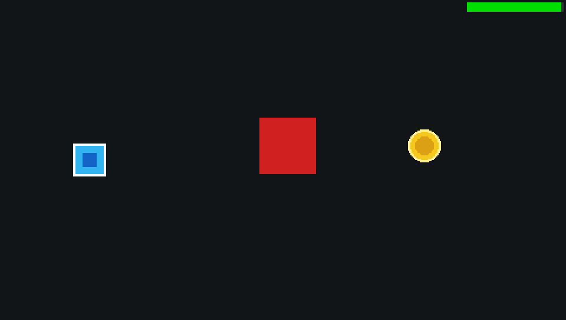

# Tutorial: Bounding Boxes & Collision Detection (2D & 3D) 💥

This tutorial explains how to manage hitboxes, triggers, and solid physical obstacles in 2D and 3D on the PlayStation Portable using the native collision routines in **PSP-Forge**.

The complete working demo associated with this guide is located in:
`demos/demo_collisions/`

<div align="center">
  
  <p><em>Solid AABB obstacle blocking and Circle coin pickup triggers with PCM audio chimes.</em></p>
</div>

---

## 1. Supported Collision Geometries

To avoid heavy polygonal mesh-mesh intersection calculations (which would saturate the 333 MHz MIPS CPU), arcade and action games rely on **Bounding Volumes** that can be evaluated in minimal CPU clock cycles:

| Geometry | Memory Footprint | Typical Usage |
|---|---|---|
| **`ForgeRect`** (2D AABB) | 16 bytes ($x, y, w, h$) | Characters, platforms, rectangular obstacles, trigger zones |
| **`ForgeCircle`** (2D Circle) | 12 bytes ($x, y, r$) | Collectible coins, projectiles, energy spheres |
| **`ForgeAABB`** (3D Box) | 24 bytes ($\min_{xyz}, \max_{xyz}$) | Vehicles, track boundaries, walls, level props |
| **`ForgeSphere`** (3D Sphere) | 16 bytes ($\text{center}_{xyz}, r$) | Proximity radii, 3D projectiles, culling spheres |

---

## 2. Collision API in `psp_forge.h`

```c
// 2D Collisions
bool forge_collide_rect_rect(ForgeRect a, ForgeRect b);
bool forge_collide_rect_circle(ForgeRect r, ForgeCircle c);
bool forge_collide_point_rect(float px, float py, ForgeRect r);

// 3D Collisions
bool forge_collide_aabb_aabb(ForgeAABB a, ForgeAABB b);
bool forge_collide_sphere_sphere(ForgeSphere a, ForgeSphere b);
bool forge_collide_aabb_sphere(ForgeAABB b, ForgeSphere s);

// Compute world-space transformed AABB for a mesh
ForgeAABB forge_mesh_get_transformed_aabb(
    const ForgeMesh* mesh,
    float x, float y, float z,
    float sx, float sy, float sz
);
```

---

## 3. C99 Implementation

### A. Solid Obstacle Detection (Rectangle vs Rectangle)
To create an impassable obstacle, record the player's previous coordinates before applying input movement. If an overlap with the obstacle occurs, revert to the previous position:

```c
float old_x = player_box.x;
float old_y = player_box.y;

// Apply input movement
player_box.x += move_x * speed * dt;
player_box.y += move_y * speed * dt;

// Check collision
if (forge_collide_rect_rect(player_box, obstacle_box)) {
    // Movement blocked: revert displacement
    player_box.x = old_x;
    player_box.y = old_y;
}
```

### B. Collectible Item / Coin Trigger (Rectangle vs Circle)
When the player's rectangular hitbox overlaps the circular coin boundary:

```c
if (forge_collide_rect_circle(player_box, coin_circle)) {
    score++;
    forge_sound_play(chime_snd, 0);

    // Reposition coin randomly across map
    coin_circle.x = 60.0f + (float)(rand() % 360);
    coin_circle.y = 40.0f + (float)(rand() % 190);
}
```

### C. 3D Model Collisions
For 3D meshes loaded via `forge_mesh_load()`, the `.p3d` binary header contains precalculated local AABB bounds produced at cook time. To check if two 3D models collide in the game world:

```c
ForgeAABB vehicle_box = forge_mesh_get_transformed_aabb(
    vehicle_mesh, veh_x, veh_y, veh_z, 1.0f, 1.0f, 1.0f
);

ForgeAABB barrier_box = forge_mesh_get_transformed_aabb(
    barrier_mesh, bar_x, bar_y, bar_z, 1.0f, 1.0f, 1.0f
);

if (forge_collide_aabb_aabb(vehicle_box, barrier_box)) {
    // Handle 3D collision impact
}
```

---

## 4. Running the Demo

```bash
cd demos/demo_collisions
psp-forge build
psp-forge run
```
- Move the player box with the D-Pad or Analog Stick.
- Hit the solid red block: it turns amber and blocks passage.
- Collect the golden coin to hear the chime audio and watch it respawn.
